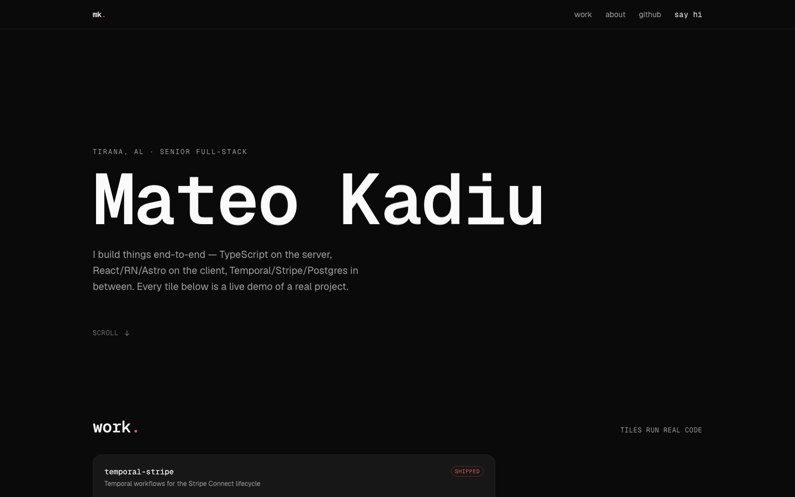
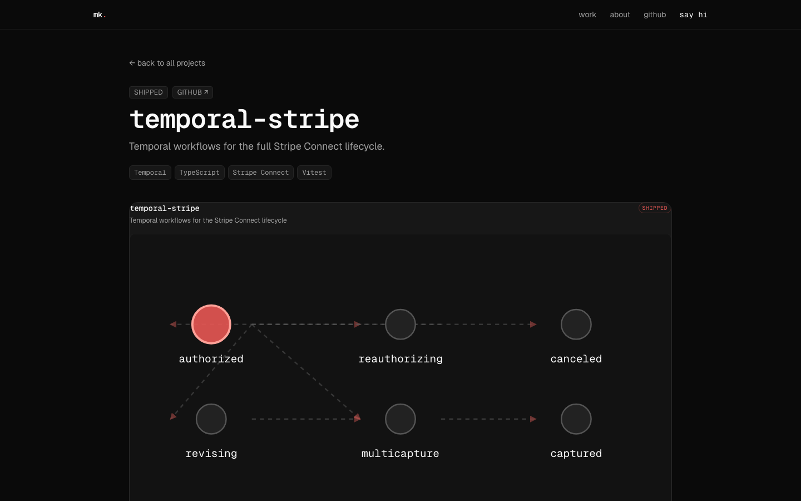
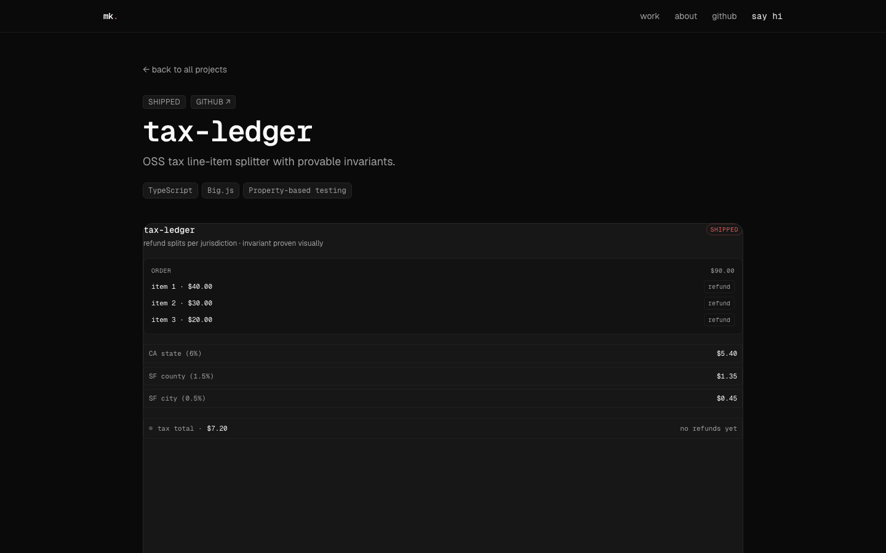

# portfolio-site

Personal portfolio at [mateokadiu.com](https://mateokadiu.com) — a bento-grid interactive showcase where every project tile is a live mini-demo of the actual work.

Astro 5 + Tailwind v4 + React islands + Framer Motion + GSAP. Zero JS on first paint, lazy-hydrated tiles, Lighthouse 95+ across the board.



A click on a tile takes you to its full deep-dive page — same demo at full size, with the architecture write-up, decisions, and Q&A.




## What's in the grid

| Tile | What it is |
|---|---|
| `tide` | Capture surfaces → extract / tag / embed / summarize pipeline of the read-later app |
| `webhook-gateway-admin` | Miniature Angular admin — signal-driven counters and filter pills |
| `shadowkit` | A real `<sk-counter>` Web Component embed proving the Shadow DOM cascade boundary |
| `studybuddy` | 53×7 SVG heatmap with staggered fill animation |
| `temporal-stripe` | Animated state machine — reauth timer, multicapture, illegal-transition shake |
| `tax-ledger` | Refund-split visualiser — jurisdiction deltas with layout animations |
| `webhook-gateway` | Retry-backoff timeline with exponential-backoff visualisation |
| `grpc-monorepo-starter` | Proto-to-clients fan-out with typewriter codegen |
| `stripe-eu-vat-moss` | EU VAT One-Stop-Shop pricing per member state, with live rates |
| `about`, `now`, `github`, `contact` | Utility tiles |

## Scripts

```bash
pnpm install
pnpm dev          # astro dev
pnpm build        # static export to dist/
pnpm preview      # serve dist/
pnpm typecheck    # astro check
pnpm lint         # biome check
pnpm test         # vitest
pnpm test:visual  # playwright visual smoke
```

## Stack

- Astro 5 (static, islands)
- Tailwind v4 via `@tailwindcss/vite`
- React 18 for interactive islands
- Framer Motion 11 for per-tile motion
- GSAP 3 (SplitText + ScrollTrigger) for the hero
- MDX for per-project deep-dives via Astro Content Collections
- Biome for lint + format, Vitest for units, Playwright for visual smoke

## Deploy

Cloudflare Pages (free tier). Build command `pnpm build`, output `dist/`. Deploys to [mateokadiu.com](https://mateokadiu.com). `mateokadiu.pages.dev` 301s to it via a Cloudflare Bulk Redirect, and every `*.pages.dev` host (including preview deploys) is sent `X-Robots-Tag: noindex` from `public/_headers`.

## License

MIT — see [LICENSE](./LICENSE).
